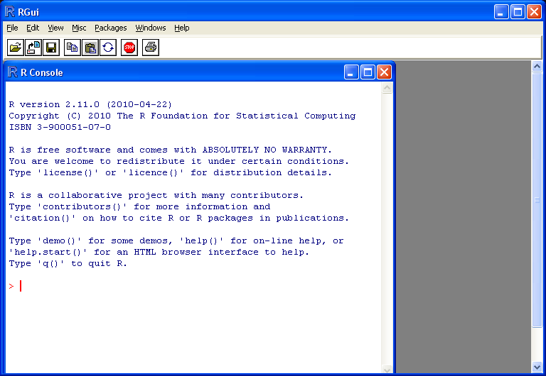
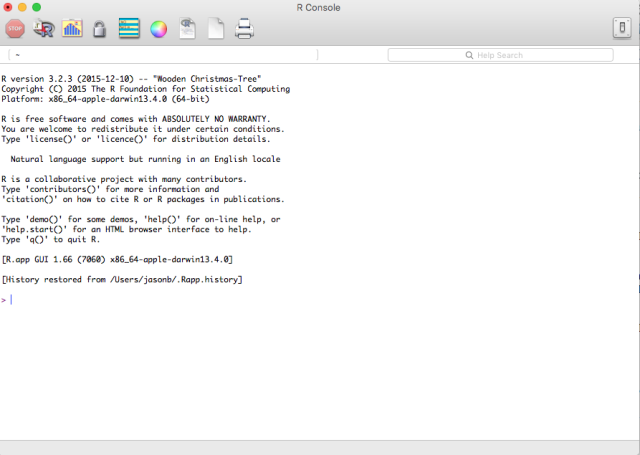
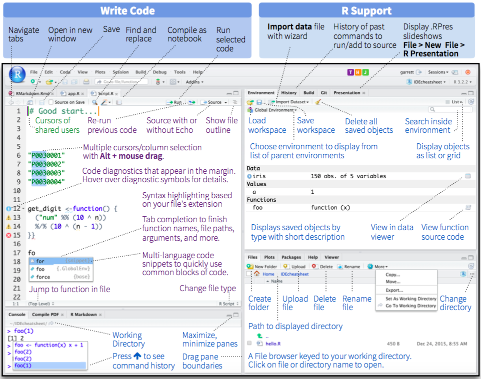

# Preface

## Why R?

- Very intuitive syntax.
- Easy to program.
- Offers functionality for a large number of statistical procedures.
- Easy to extend (software packages). 
- Sophisticated graphics capabilities.
- Creating reproducible analysis.
- **It's free**.

## What is R?

- 1990: R appeared as a free implementation of a dialect of the S language, used as programming language for the undergraduate statistics courses at the University of Auckland, New Zealand.
- 1995: R's source code made available under GNU General Public License version 2.0. 
- 1997: R files (sources, binaries and documentation) made available for download at the Comprehensive R Archive Network (CRAN). 
- 2000: R 1.0.0 (No. packages: 3)
- 2018: R. 3.5.1 (No. packages: 13,458)

Today, R is probably the most widely used software for research in statistical methodology. Also big players like Google, Bank of America, Procter & Gamble, Shell and IBM are using R for their every day business and the number of companies starts using it steadily increases.

## Where to obtain R?

https://cran.r-project.org

## (Interesting) ressources 

- Release statement ftp://cran.r-project.org/pub/R/R-release-1.0.0.html
- About R https://www.r-project.org/about.html


# R intro

R Graphical User Interface (RGui) for Windows



R application (R.app) for Mac OS X




## Language design

- R is an interpreted language.
- Interaction with R takes place at the command prompt **`>`**. 
- R interprets and executes the command, returns the output. 

**Example:** Type 2+2 at the R command prompt, and press enter. 

```{r}
2 + 2
```
R returns 4 on the console.

- If a command is not complete at the end of a line, R will give a continuation prompt **`+`**, by default.

```{r}
2 + 
  2
```

**NOTE**:
Output can be returned on the console, on the graphic device or to a file.

## Functions

- R has a pure functional core, every computation happens by evaluating functions.
- Function consists of the function name `function.name`, the function call `()` and the function arguments `argument1, argument2, argument3, ...`.
- Arguments can be variables, data, default values or other functions.

```{r}
cat("function.name(argument1 = var.x, argument2 = var.y, argument3 = data, argument4 = TRUE,  ...)")
```

- Function calls pass arguments by position or by name. If any argument is passed by name the order in which it appears is irrelevant.
- Arguments with default values are omitted. If such an argument is not specified, R takes the default value.

**Example:** The linear model function `lm()` for fitting a linear regression model.

```{r}
cat("lm(formula, data, subset, weights, na.action, method = 'qr', 
    model = TRUE, x = FALSE, y = FALSE, qr = TRUE, singular.ok = TRUE, 
    contrasts = NULL, offset, ...) ")
```

Regressing `Temp` on `Ozone` from R's `airquality` data set (daily air quality measurements in New York, May to September 1973).

```{r}
lm(Ozone ~ Temp, airquality)
```

```{r}
lm(data = airquality, formula = Ozone ~ Temp)
```

Both function calls are equivalent. R returns the original function call and the estimated model coefficients **on the console**.

**Example:** The boxplot function `boxplot()` for producing a box-and-whisker plot.

```{r}
cat("boxplot(x, ..., range = 1.5, width = NULL, varwidth = FALSE, notch = FALSE, outline = TRUE, names, plot = TRUE, border = par('fg'), col = NULL, log = '', pars = list(boxwex = 0.8, staplewex = 0.5, outwex = 0.5), horizontal = FALSE, add = FALSE, at = NULL)")
```

Producing a horizontal boxplot in gray of the monthly numbers of sunspots from R's `sunspoth.month` data set. 

```{r}
boxplot(sunspot.month, col="gray", horizontal = TRUE)
```

R returns the graphical output **on the graphic device**.

**NOTE**:
It is easier to remember the name of an argument than its position. If you can not remember the name or the position of the parameter you can get help by using `?function.name` or `help(function.name)`.


## Actions

1(a). **Plotting**. Producing graphical output (e.g., creating a plot in the graphic device).

1(b). **Printing**. Producing printed output (e.g., returning results on the console) 

2. **Assignments**. Assign the output to a name.

```{r}
mean.sunspot <- mean(sunspot.month)
```

- R operates on named data structures. The assignment operator `<-`, which consists of the two characters `<` ("less than") and `-` ("minus"), points to the name receiving the value.
- R names are unlimited in length.
- R names allow all alphanumeric symbols plus `.` and `_` (only restriction: if a name starts with `. the second character is not allowed to be a digit.)

**NOTE**:
R is case sensitive! Spaces in commands don’t matter - except for readability - but capitalisation does matter (`A` and `a` are different symbols and would refer to different things).

3. **Subsetting**. Extracting elements from the output. 

```{r}
mean.sunspot[1]
```

## (Interesting) ressources

- https://www.stat.auckland.ac.nz/~ihaka/downloads/R-paper.pdf
- More on R https://cran.r-project.org/doc/FAQ/R-FAQ.html 
- `help.start()`

Ways of obtaining help 

1. `?function.name` or `help(lm)`

2. `help.search("linear models")


# R interfaces

Graphic integrated development environments (IDE):

- Eclipse with StatET
- Emacs with ESS
- Vi, Vim and GVim
- most commonly used RStudio (https://www.rstudio.com/)

## A primer on RStudio

RStudio includes:

a. Source code editor that supports direct code execution
b. Console
c. History 
d. Workspace management
e. Graphic tools
f. Debugging, syntax-highlighting, intelligent code completion,... (and more)



## Script (.R)

The sequence of commands necessary for analysis are typically written down (scripted) in textfiles prior to execution.

Advantages: 

- Documentation of tasks.
- Automation of repetitive tasks (time saving).
- Allows evaluation of incremental changes and allows (others) to reproduce a task.

**NOTE**:
Commands are separated either by a semi-colon `;` or by a newline. 

Helping text can be putted in the script by comments. Comments can be put almost anywhere, starting with a hashmark `#`. Everything putted behind the comment is ignored by the interpreter (Note: multi-line comments are not supported). 


**Example:**

```{r}
# Regressing Temp on Ozone from R's airquality data set
lm(data = airquality, formula = Ozone ~ Temp)
# Producing a horizontal boxplot in gray of the monthly numbers of sunspots from R's sunspoth.month data set. 
boxplot(sunspot.month, col="gray", horizontal = TRUE)
```

## Workspace (.Rdata)

- The R workspace consists of all the data objects created or loaded during the R session. 
- Saving workspace means saving all R objects and commands (can again be accessed via up-arrow and down-arrow keys).
- Saving and loading can also be done at any time during the R session by the **Environment Tab**.

```{r}
save.image(file="workspace.RData")
```

## History (.Rhistory)

- Is a copy of all the key strokes (a text file that lists all of the commands that have been executed during the session).
- Useful if not all analysis steps are documented.
- Loading and saving can be done at any time during the R session by the **History Tab**

```{r}
savehistory(file = "session.Rhistory")  
loadhistory(file = "session.Rhistory")  
```

## Graphics

Graphic outputs can be saved in various formats:

| Format     | Function               |
|------------|------------------------|
| pdf        | pdf(“graph.pdf”)       |
| png        | png(“graph.png”)       |
| jpeg       | jpeg(“graph.jpeg”)     |
| bmp        | bmp(“graph.bmp”)       |
| postscript | postscript(“graph.ps”) |

Saving a graphic: 

1. Click the **Plots Tab** window, 

2. Click the **Export** button, 

3. Choose your desired format; (optional) modify the export settings, 

4. Click Save.

## (Useful) ressources

- https://www.datacamp.com/courses/working-with-the-rstudio-ide-part-1
- https://www.statmethods.net
- RStudio cheatsheet (see **Help** in the menu bar)
